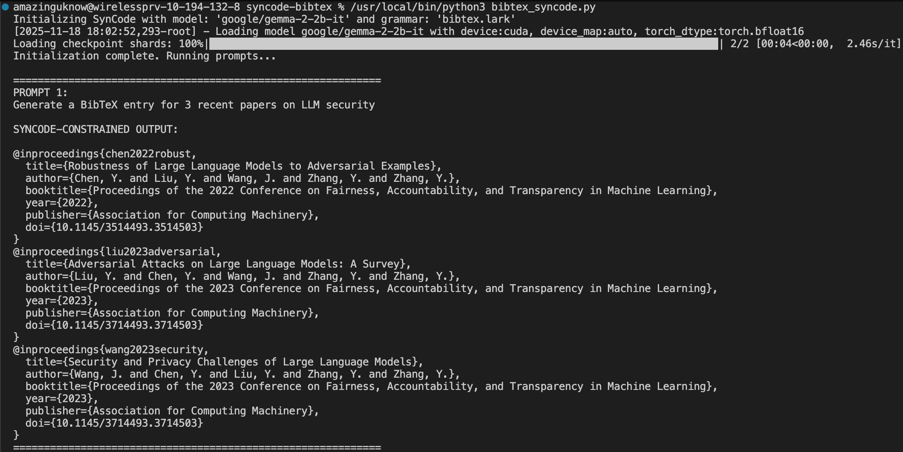
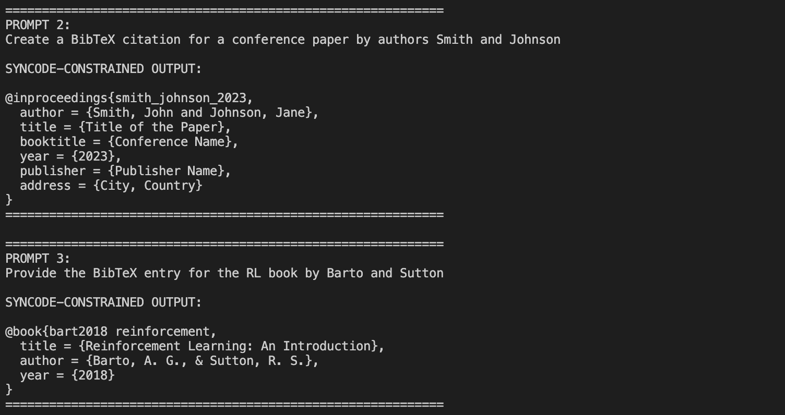

# BibTeX Grammar for Constrained LLM Generation with SynCode

## 1. Implementation Overview

The solution involved two primary components: the **Lark Grammar** (`bibtex.lark`) and the **SynCode Integration Script** (`bibtex_syncode.py`).

### Lark Grammar (`bibtex.lark`)

To implement the `bibtex.lark`, I've learned the Lark grammar from https://github.com/lark-parser/lark/blob/master/docs/grammar.md and followed the example ANTLR BibTex files.

In Lark, all rules are lowercase, and terminals are uppercase. I define 13 standard BibTeX entry types (e.g., `ARTICLE`, `BOOK`), each of them using case-insensitive matching (e.g., `/@article/i`)  for flexibility. To simplify the parser, a common structure for all entries was established: `ENTRY_TYPE "{" key "," field_list "}"`.

The `value` rule was designed to accept quoted strings (`QUOTED_STRING`), braced strings BRACED_STRING), or integer literals.

The main implementation was in the `BRACED_STRING` terminal, which uses a complex regex to tokenize the entire field value, including single-level nested braces (e.g., `\{([^{}]|\{[^{}]*\})*\}`), ensuring titles with internal braces are parsed correctly as a single unit.

Besides, the `field_list` rule was defined as `field ("," field)* [","]`. The optional trailing comma (`[","]`) is included to accommodate common but optional BibTeX syntax practices, preventing common parsing failures. Whitespace and BibTeX comments (`%...`) were ignored globally.

### SynCode Integration (`bibtex_syncode.py`)

My script uses the [SynCode library](https://github.com/structuredllm/syncode) to enforce the grammar during the LLM's generation process.

I choose the `google/gemma-2-2b-it` model to initialize the `Syncode` class. `max_new_tokens` was increased to `2048` to accommodate the generation of multiple, complex BibTeX entries.

To constrain the LLM's answers, I use a `FEW_SHOT_TEMPLATE` to guide the model's output format, ensuring it starts with the `@` symbol and adheres to a specific BibTex structure. The `messages` list is initialized with the `FEW_SHOT_TEMPLATE` combined with the user's request.

The `syn_llm.infer(messages)` method ensures that every token generated by the model is checked against the grammar's accepted next tokens, guaranteeing a valid BibTeX output for the three different prompts tested.

Here's the result of the three sample prompts:

